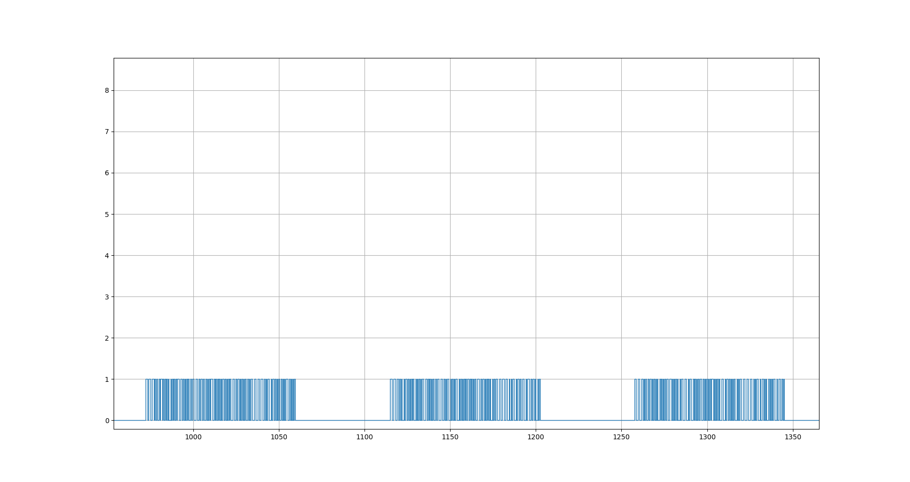

# Hideki TS33C Wireless Temperature/Humidity Sensor

Analysis and decoding of temperatures and humidity values sent by this wireless sensor.

## Technical Specifications

Item       | Value        | Description
-----------|------------- | -------------
Frequency  | 433.964 MHz |
Wavelength | 69 cm | λ=c/f
Modulation | On-off keying (OOK) |
Symbols | Pulse Width Modulation |

## Decoding Rules

Pulse lengths Tp are decoded as follows:

Timing | Tp <= 390µs | Tp > 390µs
--- | --- | ---
Symbol | `Short` | `Long`

Gaps lengths Tg are decoded as follows:

Timing | Tg <= 1140µs | Tg > 1140µs | Tg > 1550µs
--- | --- | --- | ---
Symbol | `Short` | `Long` | `Reset`

The resulting symbols are decoded as follows:

Symbol | `Short` | `Long` | `Reset`
--- | --- | --- | ---
Pulse | `1` | `0` | *Error*
Gap | *(skip)* | `0` | *Reset*

Please note that the stream-decoder adapts the values for short/long symbols for each packet by creating and evaluating a histogram of all pulse and gap lengths.

After decoding all symbols to bits, the resulting bitstream contains 90 bits and must be further processed as follows:

1. Extract parity bits and data bytes
2. Reverse data bytes (swap MSB and LSB)
3. Invert each bit of the data bytes  (xor 0xff)
4. Check parity bits and frame length
5. Extract sensor signals

## Details and Examples

### Frames are transmitted in groups of three every 42s

Time-Axis in ms

### Decoding of raw radio signal to bits


### Decoding of bits to sensor information


## Stream decoding with Gnu Radio
GNU radio block process the raw data in chunks. So the decoder must be able to handle these as well.

### Files:
* decoder.grc - GNU Radio file
* stream_decoder.py - stand-alone decoder for raw binary (demodulated) data

## Decoding on Raspberry Pi with RXB8-Receiver

The signal can also be decoded with a cheap transceiver on a Raspberry Pi.

### Hardware
* [RXB8 433 Mhz Superheterodyne Receiver](https://de.aliexpress.com/item/RXB8-433-Mhz-Superheterodyne-Funkempf-nger-Perfekte-f-r-Arduino-AVR/32673931505.html)
* 2 Resistors (4,7kΩ  and 10kΩ)
* some wiring and connectors

see [RXB8-Subfolder](./RXB8)

## Decoding with rtl_433

Use the [rtl_433-tool](https://github.com/merbanan/rtl_433) to decode the values for reference or analyze the radio data.

Please note that the output shown here is generated by a modified version of rtl_433.

```
$ rtl_433 -f 433964000 -R 42 -DD
Registering protocol [1] "HIDEKI TS04 Temperature, Humidity, Wind and Rain Sensor"
Registered 1 out of 95 device decoding protocols
Found 1 device(s)

trying device  0:  Realtek, RTL2838UHIDIR, SN: 00000001
Found Rafael Micro R820T tuner
Using device 0: Generic RTL2832U OEM
Exact sample rate is: 250000.000414 Hz
[R82XX] PLL not locked!
Sample rate set to 250000.
Bit detection level set to 0 (Auto).
Tuner gain set to Auto.
Reading samples in async mode...
Tuned to 433964000 Hz.

Pulses: 241, 231, 226, 102, 105, 104, 226, 106, 99, 104, 110, 104, 103, 103, 105, 228, 230, 105, 104, 106, 103, 103, 226, 225, 107, 226, 108, 106, 227, 106, 233, 107, 109, 104, 106, 229, 104, 108, 109, 108, 226, 226, 104, 107, 228, 104, 108, 109, 229, 104, 229, 231, 230, 229, 227, 105, 107, 226, 102, 227, 104, 105, 107, 104, 109, 107, 105,
Gaps: 257, 261, 143, 140, 261, 140, 139, 145, 139, 137, 259, 143, 141, 138, 140, 258, 138, 139, 141, 139, 265, 139, 264, 260, 139, 138, 258, 141, 259, 134, 136, 137, 139, 260, 137, 140, 138, 134, 137, 260, 264, 140, 137, 261, 260, 138, 135, 137, 261, 139, 257, 258, 259, 262, 138, 138, 262, 142, 263, 139, 138, 139, 261, 136, 136, 138, 2501,
device->name: HIDEKI TS04 Temperature, Humidity, Wind and Rain Sensor
device->short_limit: 130.000000
device->long_limit: 260.000000
n: 0 bitbuffer:: Number of rows: 1
[00] {1} 00 : 0
n: 1 bitbuffer:: Number of rows: 1
[00] {2} 00 : 00
n: 2 bitbuffer:: Number of rows: 1
[00] {3} 00 : 000
n: 3 bitbuffer:: Number of rows: 1
[00] {4} 00 : 0000
n: 4 bitbuffer:: Number of rows: 1
[00] {5} 00 : 00000
n: 6 bitbuffer:: Number of rows: 1
[00] {6} 04 : 000001
n: 8 bitbuffer:: Number of rows: 1
[00] {7} 06 : 0000011
n: 9 bitbuffer:: Number of rows: 1
[00] {8} 06 : 00000110
n: 11 bitbuffer:: Number of rows: 1
[00] {9} 06 80 : 00000110 1
n: 12 bitbuffer:: Number of rows: 1
[00] {10} 06 80 : 00000110 10
n: 14 bitbuffer:: Number of rows: 1
[00] {11} 06 a0 : 00000110 101
n: 16 bitbuffer:: Number of rows: 1
[00] {12} 06 b0 : 00000110 1011
n: 18 bitbuffer:: Number of rows: 1
[00] {13} 06 b8 : 00000110 10111
n: 20 bitbuffer:: Number of rows: 1
[00] {14} 06 bc : 00000110 101111
n: 21 bitbuffer:: Number of rows: 1
[00] {15} 06 bc : 00000110 1011110
n: 23 bitbuffer:: Number of rows: 1
[00] {16} 06 bd : 00000110 10111101
n: 25 bitbuffer:: Number of rows: 1
[00] {17} 06 bd 80 : 00000110 10111101 1
n: 27 bitbuffer:: Number of rows: 1
[00] {18} 06 bd c0 : 00000110 10111101 11
n: 29 bitbuffer:: Number of rows: 1
[00] {19} 06 bd e0 : 00000110 10111101 111
n: 30 bitbuffer:: Number of rows: 1
[00] {20} 06 bd e0 : 00000110 10111101 1110
n: 31 bitbuffer:: Number of rows: 1
[00] {21} 06 bd e0 : 00000110 10111101 11100
n: 32 bitbuffer:: Number of rows: 1
[00] {22} 06 bd e0 : 00000110 10111101 111000
n: 34 bitbuffer:: Number of rows: 1
[00] {23} 06 bd e2 : 00000110 10111101 1110001
n: 36 bitbuffer:: Number of rows: 1
[00] {24} 06 bd e3 : 00000110 10111101 11100011
n: 38 bitbuffer:: Number of rows: 1
[00] {25} 06 bd e3 80 : 00000110 10111101 11100011 1
n: 40 bitbuffer:: Number of rows: 1
[00] {26} 06 bd e3 c0 : 00000110 10111101 11100011 11
n: 41 bitbuffer:: Number of rows: 1
[00] {27} 06 bd e3 c0 : 00000110 10111101 11100011 110
n: 43 bitbuffer:: Number of rows: 1
[00] {28} 06 bd e3 d0 : 00000110 10111101 11100011 1101
n: 44 bitbuffer:: Number of rows: 1
[00] {29} 06 bd e3 d0 : 00000110 10111101 11100011 11010
n: 45 bitbuffer:: Number of rows: 1
[00] {30} 06 bd e3 d0 : 00000110 10111101 11100011 110100
n: 46 bitbuffer:: Number of rows: 1
[00] {31} 06 bd e3 d0 : 00000110 10111101 11100011 1101000
n: 47 bitbuffer:: Number of rows: 1
[00] {32} 06 bd e3 d0 : 00000110 10111101 11100011 11010000
n: 49 bitbuffer:: Number of rows: 1
[00] {33} 06 bd e3 d0 80 : 00000110 10111101 11100011 11010000 1
n: 50 bitbuffer:: Number of rows: 1
[00] {34} 06 bd e3 d0 80 : 00000110 10111101 11100011 11010000 10
n: 52 bitbuffer:: Number of rows: 1
[00] {35} 06 bd e3 d0 a0 : 00000110 10111101 11100011 11010000 101
n: 53 bitbuffer:: Number of rows: 1
[00] {36} 06 bd e3 d0 a0 : 00000110 10111101 11100011 11010000 1010
n: 55 bitbuffer:: Number of rows: 1
[00] {37} 06 bd e3 d0 a8 : 00000110 10111101 11100011 11010000 10101
n: 56 bitbuffer:: Number of rows: 1
[00] {38} 06 bd e3 d0 a8 : 00000110 10111101 11100011 11010000 101010
n: 57 bitbuffer:: Number of rows: 1
[00] {39} 06 bd e3 d0 a8 : 00000110 10111101 11100011 11010000 1010100
n: 59 bitbuffer:: Number of rows: 1
[00] {40} 06 bd e3 d0 a9 : 00000110 10111101 11100011 11010000 10101001
n: 60 bitbuffer:: Number of rows: 1
[00] {41} 06 bd e3 d0 a9 00 : 00000110 10111101 11100011 11010000 10101001 0
n: 62 bitbuffer:: Number of rows: 1
[00] {42} 06 bd e3 d0 a9 40 : 00000110 10111101 11100011 11010000 10101001 01
n: 64 bitbuffer:: Number of rows: 1
[00] {43} 06 bd e3 d0 a9 60 : 00000110 10111101 11100011 11010000 10101001 011
n: 66 bitbuffer:: Number of rows: 1
[00] {44} 06 bd e3 d0 a9 70 : 00000110 10111101 11100011 11010000 10101001 0111
n: 67 bitbuffer:: Number of rows: 1
[00] {45} 06 bd e3 d0 a9 70 : 00000110 10111101 11100011 11010000 10101001 01110
n: 69 bitbuffer:: Number of rows: 1
[00] {46} 06 bd e3 d0 a9 74 : 00000110 10111101 11100011 11010000 10101001 011101
n: 70 bitbuffer:: Number of rows: 1
[00] {47} 06 bd e3 d0 a9 74 : 00000110 10111101 11100011 11010000 10101001 0111010
n: 72 bitbuffer:: Number of rows: 1
[00] {48} 06 bd e3 d0 a9 75 : 00000110 10111101 11100011 11010000 10101001 01110101
n: 74 bitbuffer:: Number of rows: 1
[00] {49} 06 bd e3 d0 a9 75 80 : 00000110 10111101 11100011 11010000 10101001 01110101 1
n: 76 bitbuffer:: Number of rows: 1
[00] {50} 06 bd e3 d0 a9 75 c0 : 00000110 10111101 11100011 11010000 10101001 01110101 11
n: 78 bitbuffer:: Number of rows: 1
[00] {51} 06 bd e3 d0 a9 75 e0
n: 79 bitbuffer:: Number of rows: 1
[00] {52} 06 bd e3 d0 a9 75 e0
n: 80 bitbuffer:: Number of rows: 1
[00] {53} 06 bd e3 d0 a9 75 e0
n: 81 bitbuffer:: Number of rows: 1
[00] {54} 06 bd e3 d0 a9 75 e0
n: 82 bitbuffer:: Number of rows: 1
[00] {55} 06 bd e3 d0 a9 75 e0
n: 84 bitbuffer:: Number of rows: 1
[00] {56} 06 bd e3 d0 a9 75 e1
n: 86 bitbuffer:: Number of rows: 1
[00] {57} 06 bd e3 d0 a9 75 e1 80
n: 87 bitbuffer:: Number of rows: 1
[00] {58} 06 bd e3 d0 a9 75 e1 80
n: 88 bitbuffer:: Number of rows: 1
[00] {59} 06 bd e3 d0 a9 75 e1 80
n: 89 bitbuffer:: Number of rows: 1
[00] {60} 06 bd e3 d0 a9 75 e1 80
n: 91 bitbuffer:: Number of rows: 1
[00] {61} 06 bd e3 d0 a9 75 e1 88
n: 93 bitbuffer:: Number of rows: 1
[00] {62} 06 bd e3 d0 a9 75 e1 8c
n: 95 bitbuffer:: Number of rows: 1
[00] {63} 06 bd e3 d0 a9 75 e1 8e
n: 96 bitbuffer:: Number of rows: 1
[00] {64} 06 bd e3 d0 a9 75 e1 8e
n: 97 bitbuffer:: Number of rows: 1
[00] {65} 06 bd e3 d0 a9 75 e1 8e 00
n: 99 bitbuffer:: Number of rows: 1
[00] {66} 06 bd e3 d0 a9 75 e1 8e 40
n: 100 bitbuffer:: Number of rows: 1
[00] {67} 06 bd e3 d0 a9 75 e1 8e 40
n: 101 bitbuffer:: Number of rows: 1
[00] {68} 06 bd e3 d0 a9 75 e1 8e 40
n: 102 bitbuffer:: Number of rows: 1
[00] {69} 06 bd e3 d0 a9 75 e1 8e 40
n: 103 bitbuffer:: Number of rows: 1
[00] {70} 06 bd e3 d0 a9 75 e1 8e 40
n: 104 bitbuffer:: Number of rows: 1
[00] {71} 06 bd e3 d0 a9 75 e1 8e 40
n: 105 bitbuffer:: Number of rows: 1
[00] {72} 06 bd e3 d0 a9 75 e1 8e 40
n: 106 bitbuffer:: Number of rows: 1
[00] {73} 06 bd e3 d0 a9 75 e1 8e 40 00
n: 107 bitbuffer:: Number of rows: 1
[00] {74} 06 bd e3 d0 a9 75 e1 8e 40 00
n: 108 bitbuffer:: Number of rows: 1
[00] {75} 06 bd e3 d0 a9 75 e1 8e 40 00
n: 110 bitbuffer:: Number of rows: 1
[00] {76} 06 bd e3 d0 a9 75 e1 8e 40 10
n: 112 bitbuffer:: Number of rows: 1
[00] {77} 06 bd e3 d0 a9 75 e1 8e 40 18
n: 113 bitbuffer:: Number of rows: 1
[00] {78} 06 bd e3 d0 a9 75 e1 8e 40 18
n: 114 bitbuffer:: Number of rows: 1
[00] {79} 06 bd e3 d0 a9 75 e1 8e 40 18
n: 116 bitbuffer:: Number of rows: 1
[00] {80} 06 bd e3 d0 a9 75 e1 8e 40 19
n: 117 bitbuffer:: Number of rows: 1
[00] {81} 06 bd e3 d0 a9 75 e1 8e 40 19 00
n: 118 bitbuffer:: Number of rows: 1
[00] {82} 06 bd e3 d0 a9 75 e1 8e 40 19 00
n: 120 bitbuffer:: Number of rows: 1
[00] {83} 06 bd e3 d0 a9 75 e1 8e 40 19 20
n: 122 bitbuffer:: Number of rows: 1
[00] {84} 06 bd e3 d0 a9 75 e1 8e 40 19 30
n: 124 bitbuffer:: Number of rows: 1
[00] {85} 06 bd e3 d0 a9 75 e1 8e 40 19 38
n: 125 bitbuffer:: Number of rows: 1
[00] {86} 06 bd e3 d0 a9 75 e1 8e 40 19 38
n: 127 bitbuffer:: Number of rows: 1
[00] {87} 06 bd e3 d0 a9 75 e1 8e 40 19 3a
n: 129 bitbuffer:: Number of rows: 1
[00] {88} 06 bd e3 d0 a9 75 e1 8e 40 19 3b
n: 131 bitbuffer:: Number of rows: 1
[00] {89} 06 bd e3 d0 a9 75 e1 8e 40 19 3b 80
n: 132 bitbuffer:: Number of rows: 1
[00] {90} 06 bd e3 d0 a9 75 e1 8e 40 19 3b c0
bitbuffer:: Number of rows: 1
[00] {90} 06 bd e3 d0 a9 75 e1 8e 40 19 3b c0
Packet: 9f 21 0e 5e 16 c2 39 fb 67 11
2017-11-22 10:27:04 :	HIDEKI TS04 sensor
	Rolling Code:	 1
	Channel:	 1
	Battery:	 OK
	Temperature:	 21.6 C
	Humidity:	 39 %
pulse_demod_clock_bits(): HIDEKI TS04 Temperature, Humidity, Wind and Rain Sensor
bitbuffer:: Number of rows: 1
[00] {90} 06 bd e3 d0 a9 75 e1 8e 40 19 3b c0
n: 133 bitbuffer:: Number of rows: 0
Pulse data: 67 pulses
[  0] Pulse:  241, Gap:  257, Period:  498 -> 00
[  1] Pulse:  231, Gap:  261, Period:  492 -> 00
[  2] Pulse:  226, Gap:  143, Period:  369 -> 0
[  3] Pulse:  102, Gap:  140, Period:  242 -> 1
[  4] Pulse:  105, Gap:  261, Period:  366 -> 10
[  5] Pulse:  104, Gap:  140, Period:  244 -> 1
[  6] Pulse:  226, Gap:  139, Period:  365 -> 0
[  7] Pulse:  106, Gap:  145, Period:  251 -> 1
[  8] Pulse:   99, Gap:  139, Period:  238 -> 1
[  9] Pulse:  104, Gap:  137, Period:  241 -> 1
[ 10] Pulse:  110, Gap:  259, Period:  369 -> 10
[ 11] Pulse:  104, Gap:  143, Period:  247 -> 1      (0000.0110,1011.1101)
[ 12] Pulse:  103, Gap:  141, Period:  244
[ 13] Pulse:  103, Gap:  138, Period:  241
[ 14] Pulse:  105, Gap:  140, Period:  245
[ 15] Pulse:  228, Gap:  258, Period:  486
[ 16] Pulse:  230, Gap:  138, Period:  368
[ 17] Pulse:  105, Gap:  139, Period:  244
[ 18] Pulse:  104, Gap:  141, Period:  245
[ 19] Pulse:  106, Gap:  139, Period:  245
[ 20] Pulse:  103, Gap:  265, Period:  368
[ 21] Pulse:  103, Gap:  139, Period:  242
[ 22] Pulse:  226, Gap:  264, Period:  490
[ 23] Pulse:  225, Gap:  260, Period:  485
[ 24] Pulse:  107, Gap:  139, Period:  246
[ 25] Pulse:  226, Gap:  138, Period:  364
[ 26] Pulse:  108, Gap:  258, Period:  366
[ 27] Pulse:  106, Gap:  141, Period:  247
[ 28] Pulse:  227, Gap:  259, Period:  486
[ 29] Pulse:  106, Gap:  134, Period:  240
[ 30] Pulse:  233, Gap:  136, Period:  369
[ 31] Pulse:  107, Gap:  137, Period:  244
[ 32] Pulse:  109, Gap:  139, Period:  248
[ 33] Pulse:  104, Gap:  260, Period:  364
[ 34] Pulse:  106, Gap:  137, Period:  243
[ 35] Pulse:  229, Gap:  140, Period:  369
[ 36] Pulse:  104, Gap:  138, Period:  242
[ 37] Pulse:  108, Gap:  134, Period:  242
[ 38] Pulse:  109, Gap:  137, Period:  246
[ 39] Pulse:  108, Gap:  260, Period:  368
[ 40] Pulse:  226, Gap:  264, Period:  490
[ 41] Pulse:  226, Gap:  140, Period:  366
[ 42] Pulse:  104, Gap:  137, Period:  241
[ 43] Pulse:  107, Gap:  261, Period:  368
[ 44] Pulse:  228, Gap:  260, Period:  488
[ 45] Pulse:  104, Gap:  138, Period:  242
[ 46] Pulse:  108, Gap:  135, Period:  243
[ 47] Pulse:  109, Gap:  137, Period:  246
[ 48] Pulse:  229, Gap:  261, Period:  490
[ 49] Pulse:  104, Gap:  139, Period:  243
[ 50] Pulse:  229, Gap:  257, Period:  486
[ 51] Pulse:  231, Gap:  258, Period:  489
[ 52] Pulse:  230, Gap:  259, Period:  489
[ 53] Pulse:  229, Gap:  262, Period:  491
[ 54] Pulse:  227, Gap:  138, Period:  365
[ 55] Pulse:  105, Gap:  138, Period:  243
[ 56] Pulse:  107, Gap:  262, Period:  369
[ 57] Pulse:  226, Gap:  142, Period:  368
[ 58] Pulse:  102, Gap:  263, Period:  365
[ 59] Pulse:  227, Gap:  139, Period:  366
[ 60] Pulse:  104, Gap:  138, Period:  242
[ 61] Pulse:  105, Gap:  139, Period:  244
[ 62] Pulse:  107, Gap:  261, Period:  368
[ 63] Pulse:  104, Gap:  136, Period:  240
[ 64] Pulse:  109, Gap:  136, Period:  245
[ 65] Pulse:  107, Gap:  138, Period:  245
[ 66] Pulse:  105, Gap: 2501, Period: 2606

```

### decoding sequence rtl_433

1. rtlsdr_callback()
2. Convert to magnitude and filter
3. pulse_detect_package()
4. pulse_demod_clock_bits()
5. hideki_ts04_callback()

## References

* https://github.com/pimatic/rfcontroljs/issues/68
* https://github.com/merbanan/rtl_433
* http://www.hidekielectronics.com/?m=99
* https://github.com/kevinmehall/rtlsdr-433m-sensor
