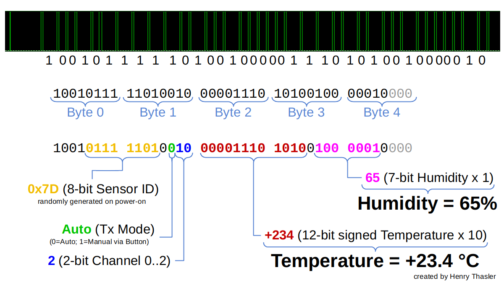

# baldr 433Mhz temperature and humidity sensor

The [Baldr Outdoor Sensor](https://baldr.com/products/touch-buttons-lcd-weather-station-with-moon-phase-1) looks just like the [kwmobile sensor](../kwmobile/README.md) but the encoding is a bit different.

## Technical Specifications
Item | Value | Description
-------------: | ------------- | :-------------
Channels | 3 |
Frequency  | 433.89MHz | 
Modulation | [PPM](https://en.wikipedia.org/wiki/Pulse-position_modulation) | 
Symbol-Rate | variable |
Symbol-Encoding | Pulse-Width |
Transmission Interval | 50s | 

## Analyze samples

Sniff raw IQ-Data with `rtl_sdr -f 434000000 -s 2048000 sample.cu8`

Analyze with [inspectrum](https://github.com/miek/inspectrum): `$ inspectrum sample.cu8 -r 2048000`

## Decoding Rules

Type | Timing
--- | --- 
`very short` | 50µs
`short` | 585µs
`medium` | 2000µs
`long` | 4000µs
`very long` | 9000µs

Symbol | Meaning | Comment
--- | --- | ---
`very short` pulse followed by `very long` gap | start of transmission |
`short` pulse followed by `medium` gap | `0` |
`short` pulse followed by `long` gap | `1` |
`short` pulse followed by `very long` gap | inter-frame gap |
`short` pulse followed by `very long` gap and a `short` pulse | end of transmission |

Each transmission contains multiple (7) consecutive frames with the same content.

## Decoding with RFM89-Module

tbd