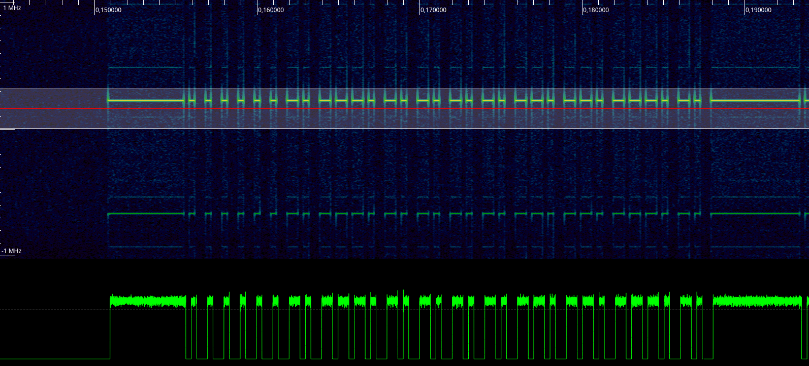

# berner remote control


# Technical Specifications
Item | Value | Description
-------------: | ------------- | :-------------
Model | BHS140 |
Encoding | fixed, unidirectional |
Channels | 4 |
Frequency  | 868.2MHz |
Modulation | On-Off-Keying (OOK) | 
Symbol-Rate | 1 kHz |
Symbol-Encoding | Pulse-Width |
Antenna-Length (λ/4) | 86mm

## analyze samples

First step is to gather and analyze the data sent by the hand-held transmitter. Start rtl_sdr (or whatever tool you are using) and press a few buttons on the transmitter.

```
$ rtl_sdr -f 868000000 -s 2048000 sample.cu8
Found 1 device(s):
  0:  Realtek, RTL2838UHIDIR, SN: 00000001

Using device 0: Generic RTL2832U OEM
Found Rafael Micro R820T tuner
[R82XX] PLL not locked!
Sampling at 2048000 S/s.
Tuned to 868000000 Hz.
Tuner gain set to automatic.
Reading samples in async mode...
^CSignal caught, exiting!

User cancel, exiting...
```

Analyze the data with inspectrum: `$ inspectrum sample.cu8`




## Decoding Rules

Each frame consists of a preamble and 32-bits of data (e.g. `0x02 0xEA 0xAB 0xBF`):

Symbol | Meaning | Comment
--- | --- | ---
`very long` Pulse followed by `short` gap| *Preamble* | the first frame actually has a shorter preamble of 4667µs
`short` pulse followed by `long` gap | `0` | (duty factor < 0.5)
`long` pulse followed by `short` gap | `1` | (duty factor > 0.5)

Type | Timing
--- | --- 
`very long` | 5440µs
`long` | 333µs
`short` | 667µs

Upon pressing the button on the hand-held, several frames are transmitted successively.

# Tools

* `sniff.py` - a command-line tool to read and decode hand-held transmitter data using my [python RFM69-library](https://github.com/henrythasler/rfm69) on a Raspberry Pi.
* `transmitter.py` - a command-line tool to previously gathered codes via the RFM69-module.

# References
* http://berner-torantriebe.eu/files/berner_handsender_090516.pdf
