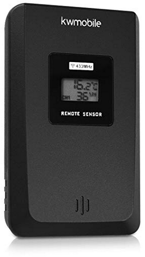
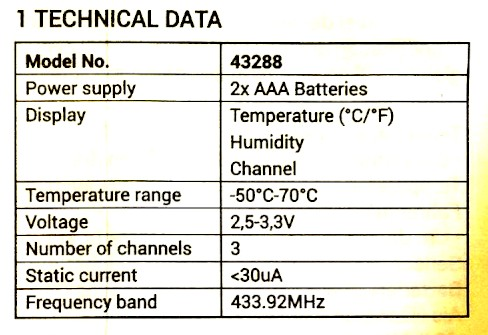
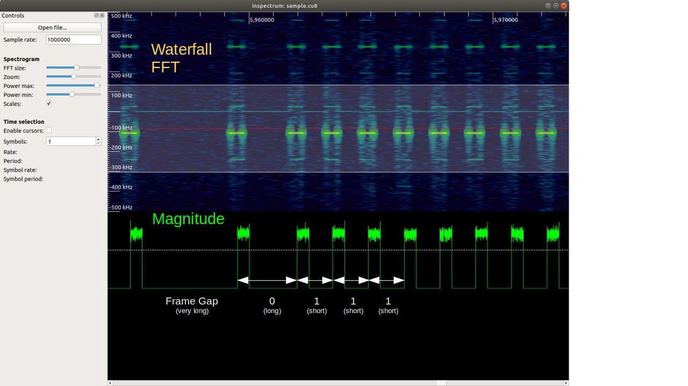
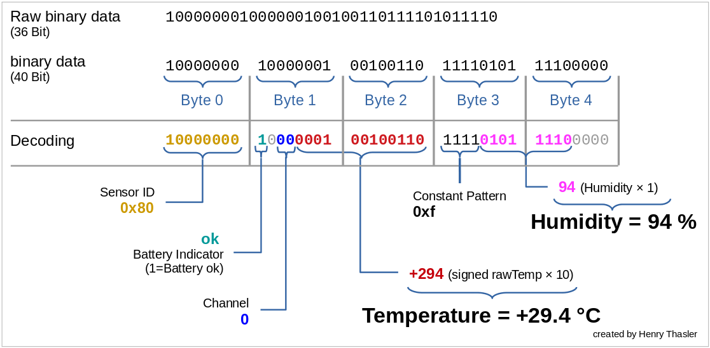

# kwmobile 433Mhz temperature and humidity sensor

This is a description of how to grab sensor data from a 433MHz wireless temperature and humidity sensor. The brand could be kwmobile or something else. Just look at the general appearance. If it looks similar to this appliance, there is a good chance it will work.



## Technical Specifications
Item | Value | Description
-------------: | ------------- | :-------------
Channels | 3 |
Frequency  | 433.92MHz | 
Modulation | [PPM](https://en.wikipedia.org/wiki/Pulse-position_modulation) | 
Symbol-Rate | variable |
Symbol-Encoding | Pulse-Width |



## Hardware Setup

Hook up your RTL2832U-based USB-receiver [RTL_SDR by Radioddity](https://www.radioddity.com/collections/analog-sdr/products/100khz-1766mhz-0-1mhz-1-7ghz-full-band-100khz-1766mhz-0-1mhz-1-7ghz-full-band) or whatever you want to use.

## Analyze samples

Sniff raw IQ-Data with `rtl_sdr -f 434000000 -s 2048000 sample.cu8`

Analyze with [inspectrum](https://github.com/miek/inspectrum): `$ inspectrum sample.cu8`

## Decoding Rules



Symbol | Meaning | Comment
--- | --- | ---
`very short` pulse followed by `short` gap | `0` | 
`very short` pulse followed by `long` gap | `1` | 
`very short` pulse followed by `very long` gap | end of frame | 

Type | Timing
--- | --- 
`very short` | 500µs
`short` | 1000µs
`long` | 2000µs
`very long` | 4000µs



## Decoding with rtl_433

```
$ rtl_433 -vv- a -f 433.92M -s 1024k
time      : 2019-02-09 10:10:19
model     : Nexus Temperature/Humidity             House Code: 128
Channel   : 1            Battery   : OK            Temperature: 27.30 C      Humidity  : 96 %
pulse_demod_ppm(): Nexus Temperature & Humidity Sensor 
bitbuffer:: Number of rows: 12 
[00] {36} 80 81 11 f6 00 : 10000000 10000001 00010001 11110110 0000
[01] {36} 80 81 11 f6 00 : 10000000 10000001 00010001 11110110 0000
[02] {36} 80 81 11 f6 00 : 10000000 10000001 00010001 11110110 0000
[03] {36} 80 81 11 f6 00 : 10000000 10000001 00010001 11110110 0000
```

## Decoding with RFM89-Module
```
henry@i7-bionic:~/dev/sdr/kwmobile$ python sniff.py 
Scanning... Press Ctrl-C to abort
Frame: 80 81 26 F5 E0 10000000  10000001  00100110  11110101  11100000  - ID=128  Channel=0 Battery=True  29.4°C  94% rH
Frame: 80 81 26 F5 E0 10000000  10000001  00100110  11110101  11100000  - ID=128  Channel=0 Battery=True  29.4°C  94% rH
Frame: 80 81 26 F5 E0 10000000  10000001  00100110  11110101  11100000  - ID=128  Channel=0 Battery=True  29.4°C  94% rH
Frame: 80 81 26 F5 E0 10000000  10000001  00100110  11110101  11100000  - ID=128  Channel=0 Battery=True  29.4°C  94% rH
Frame: 80 81 26 F5 E0 10000000  10000001  00100110  11110101  11100000  - ID=128  Channel=0 Battery=True  29.4°C  94% rH
Frame: 80 81 26 F5 E0 10000000  10000001  00100110  11110101  11100000  - ID=128  Channel=0 Battery=True  29.4°C  94% rH
```

## Installation for RPI3

- [install pigpio](http://abyz.me.uk/rpi/pigpio/download.html)

Installing from source does not set up a systemd-config file. So we do it manually:
```
sudo nano /etc/systemd/system/pigpiod.service
    [Unit]
    Description=Daemon required to control GPIO pins via pigpio
    [Service]
    ExecStart=/usr/local/bin/pigpiod -s 5 -b 200
    ExecStop=/bin/systemctl kill -s SIGKILL pigpiod
    Type=forking
    [Install]
    WantedBy=multi-user.target

sudo systemctl enable pigpiod
sudo systemctl start pigpiod
```

additional software:
```
sudo apt-get install git python3-pip libatlas-base-dev postgresql-client
pip3 install numpy psycopg2 paho-mqtt
git clone https://github.com/henrythasler/sdr.git
cd sdr/kwmobile
python3 decoder.py
```

To enable a systemd-service:

```
sudo cp decoder.service /etc/systemd/system/
sudo nano /etc/systemd/system/decoder.service
    # modify path to decoder.py and user/group accordingly
sudo systemctl enable decoder.service
sudo systemctl start decoder.service

```

check logfile with `sudo journalctl -u decoder.service`

## References

- https://github.com/merbanan/rtl_433
- https://github.com/merbanan/rtl_433/blob/master/src/devices/nexus.c
- https://github.com/aquaticus/nexus433