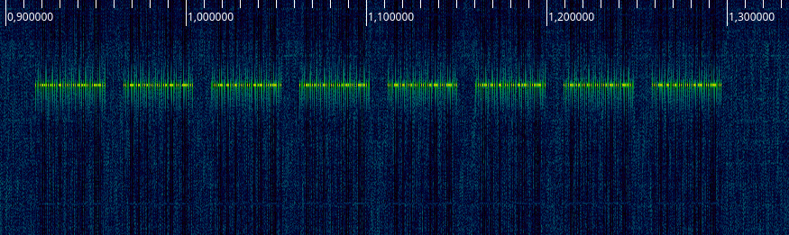
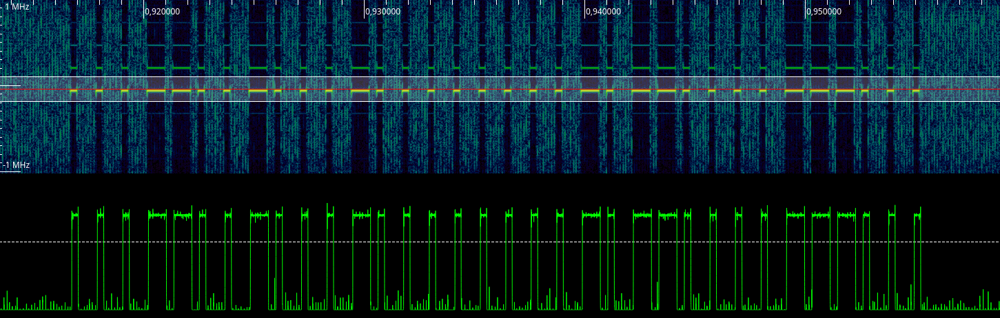

# Mumbi FS300


# Technical Specifications
Item | Value | Description
-------------: | ------------- | :-------------
Model | m-FS300 |
Encoding |  |
Channels |  |
Frequency  | 434.92 MHz |
Modulation | On-Off-Keying (OOK) | 
Symbol-Rate | 865 Hz |
Symbol-Encoding | pulse-width-encoding |

## analyze samples

First step is to gather and analyze the data sent by the hand-held transmitter. Start rtl_sdr (or whatever tool you are using) and press a few buttons on the transmitter.

```
$ rtl_sdr -f 434000000 -s 2048000 sample.cu8
Found 1 device(s):
  0:  Realtek, RTL2838UHIDIR, SN: 00000001

Using device 0: Generic RTL2832U OEM
Found Rafael Micro R820T tuner
[R82XX] PLL not locked!
Sampling at 2048000 S/s.
Tuned to 434000000 Hz.
Tuner gain set to automatic.
Reading samples in async mode...
^CSignal caught, exiting!

User cancel, exiting...
```

Analyze the data with inspectrum:

`$ inspectrum sample.cu8`
Upon pressing a button, 8 consecutive frames are sent within 350ms:


Closer inspection reveals, that the modulation is On-Off-Keying (OOK) with pulse-width encoding:


## Decoding Rules

Each frame consists of a preamble and 34-bits of data (e.g. `0x02 0xEA 0xAB 0xBF`). Let's assume the following rules:

Symbol | Meaning | Comment
--- | --- | ---
`short` pulse followed by `long` gap | `0` | (duty factor < 0.5)
`long` pulse followed by `short` gap | `1` | (duty factor > 0.5)

Type | Timing
--- | --- 
`long` | 820 µs
`short` | 300 µs

Upon pressing the button on the hand-held, at least eight frames are transmitted successively.

## Tools

* `sniff.py` - a command-line tool to read and decode hand-held transmitter data using my [python RFM69-library](https://github.com/henrythasler/rfm69) on a Raspberry Pi. Also used to analyze the protocol and generate the charts shown below.
* `transmitter.py` - (coming soon)

## Protocol analysis

The hand-held remote transmits several frames with 34 pulses for each key resulting in 34 bits according to the decoding rules above. Visualizing the bits as a 2D-histogram can support a preliminary analysis. The color in this chart represents the average value for each bit:


Obviously there are a lot of zeros involved. Nonetheless do we figure, that there is something like a fixed pattern and a variable part.

The fixed part could be a uniqe ID for each hand-held transmitter.

The variable part (8 bits) is more interesting so we look at these some more:

Group | Action | Value | Value (swapped)
---|---|---|---
A | On | `1111 1001` | `1001 1111`
A | Off | `1110 1000`| `1000 1110`
B | On | `1101 1010` | `1010 1101`
B | Off | `1100 1011`| `1011 1100`
C | On | `1011 1110` | `1110 1011`
C | Off | `1010 1111`| `1111 1010`
D | On | `0111 0001` | `0001 0111`
D | Off | `0110 0000`| `0000 0110`
All | On | `0100 0011` | `0011 0100`
All | Off | `1000 1101`| `1101 1000`

No great insights, except the 4th bit of the value representing on/off except with the All-Button.

## Transmitting

No suprise here. We just send out the previously sniffed 34-bit values and be done with it. 

Except that we can use the more general timing of 1kHz for pulses and pause durations:

Type | Timing | Comment
--- | --- | ---
`long` | 667 µs
`short` | 333 µs
`pause` | 10000 µs | between repetitions

## References

* ???
