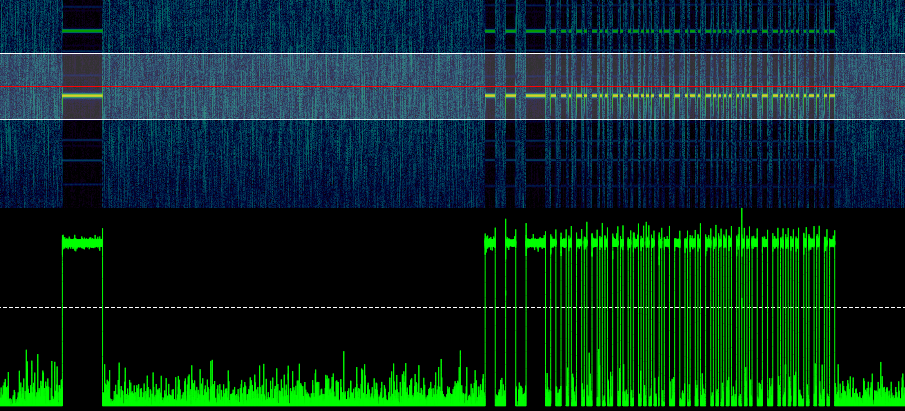
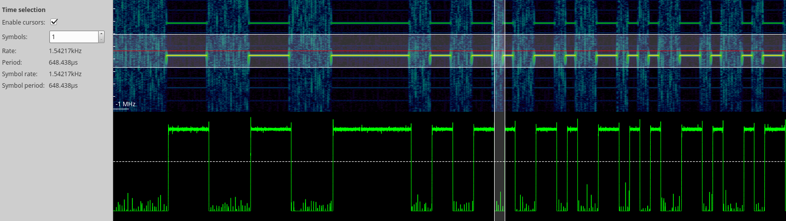
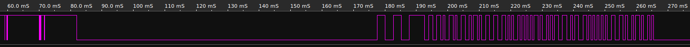

# Somfy Telis 1 RTS remote control

Remote control for various home appliances.

## Technical Specifications

Item | Value | Description
-------------: | ------------- | :-------------
Frequency  | 433.42 MHz |
Symbol-rate | 775 Hz
Encoding | Manchester | rising edge = 1, falling edge = 0

## Signal Charactersistics

Frame including leading Wake-up pulse:


Sync pattern and start of frame:


Decoding of frame data according to [Somfy Smoove Origin RTS Protocol](https://pushstack.wordpress.com/somfy-rts-protocol/)

## Decoding Tool

`sniff.py` - a command-line tool to read and decode hand-held transmitter data using my [python RFM69-library](https://github.com/henrythasler/rfm69)

```bash
$ python sniff.py
Scanning... Press Ctrl-C to abort
Clock Sync: [ 2520.  2625.  2495.  2615.] 640
Frame: 0xA6 0x16 0x11 0x46 0xBD 0x5F 0x36
    Control: 0x01
    Checksum: ok
    Address: BD 5F 36
    Rolling Code: 11 46
```

The RFM69 Data-Pin looks like this:


## Transmission

## References

* https://www.somfy.de/produkte/1810630/telis-1-rts-
* [Somfy Smoove Origin RTS Protocol](https://pushstack.wordpress.com/somfy-rts-protocol/)
* [NodeMCU Somfy module](https://nodemcu.readthedocs.io/en/master/en/modules/somfy/)
* [QUICK PROGRAMMING GUIDE FOR ALL RTS MOTORS](http://www.automatedshadeinc.com/files/motors/all-somfy-rts%20motors-programming-quick-guide-02-09.pdf)

