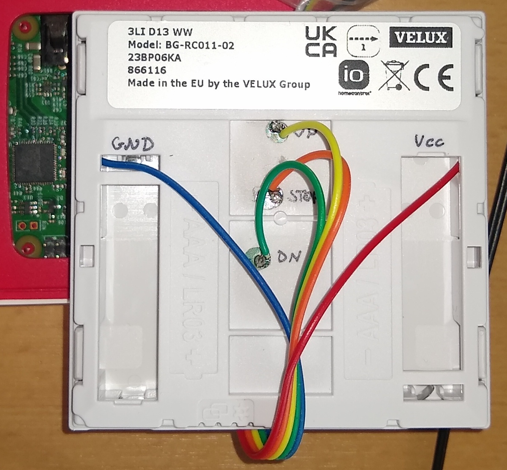

# Velux Integra KLI 310/311/312/313

The VELUX INTEGRA KLI remote control is used to control shades, blind and other stuff. I understand that their protocol is difficult to reverser engineer I need a remote control for the remote control...

## Wiring

Wiring is done according to [yannikmotzet: VELUX INTEGRA® Control](https://github.com/yannikmotzet/velux-integra-control):

## Software

Based on pigpiod. see [transmitter.py](./transmitter.py).

## Home Automation

The [transmitter.py](./transmitter.py) is executed inside a node-red flow.

## Radio Protocol Decoding

see `decoder.py`

## References

- [yannikmotzet: VELUX INTEGRA® Control](https://github.com/yannikmotzet/velux-integra-control)
- [thorio: ESPHome Velux Controller](https://github.com/thorio/esphome-projects/tree/master/velux-controller)
- [ottelo: Velux Integra Dachfenster Rollladen - ESP8266 (KLI 310)](https://ottelo.jimdofree.com/velux-integra-esp8266/)
- [iown-homecontrol](https://github.com/Velocet/iown-homecontrol)